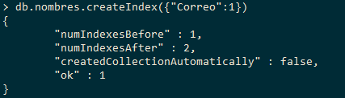

# Consultar

### db.coleccion.find()

recolecta todos los registros dentro de la coleccion



### db.coleccion.find().pretty()

lo mismo, pero mejor estructurado.&#x20;

recomendado para altos volumenes de registros

.png>)


### db.coleccion.find({argumento})

dentro del argumento busco que quiero que me traiga de la coleccion, este seria el where

.png>)

## Consulta multiple

se usan operadores logicos and u or

### Estructura

ojo con las sintaxis de cochetes y llaves

```
db.coleccion.find(
{$operador: [{argumentoA},{argumentoB}] 
});
```

### Ejemplo

.png>)


## Consulta la primera sentencia que encuentre

db.coleccion.findOne(argumento)

.png>)

